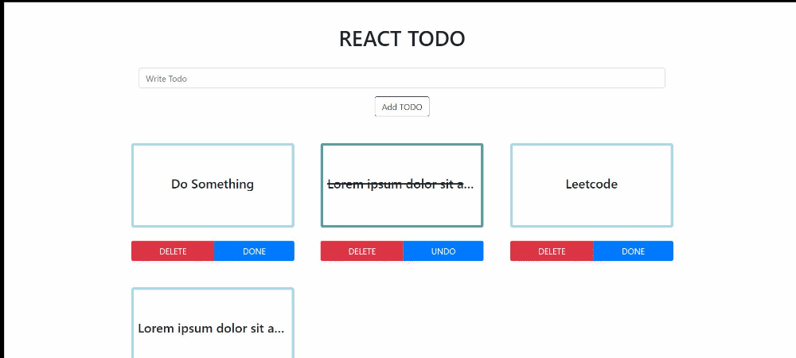

# A Todo List using ReactJS

A Simple Todo List App made using ReactJS. I used [react-bootstrap](https://react-bootstrap.netlify.app/) for styling.

## Demo

- [Netlify](https://react-todo-128.netlify.app/)
- 

## Setup and Run Locally

- Clone this repository and install the Packages
  ```
  git clone https://github.com/ish-u/react-todo.git
  cd react-todo
  npm install
  ```
- To Run
  ```
  npm start
  ```
- Open [http://localhost:3000](http://localhost:3000) to view it in the browser.

###### Just another Product of my Existential Crisis
